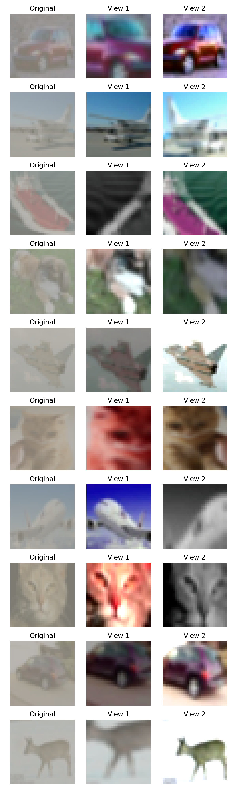
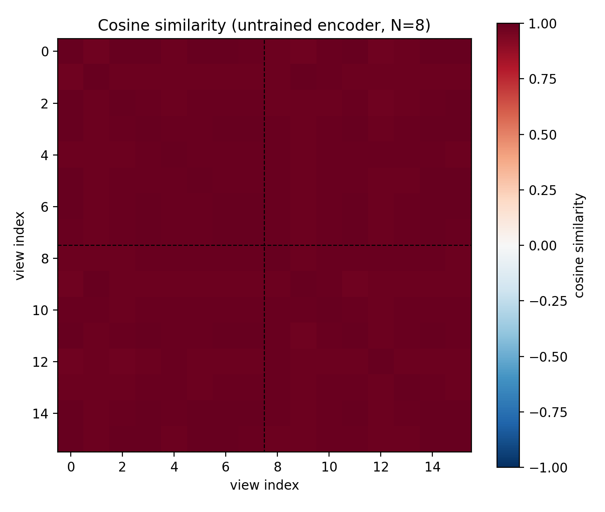
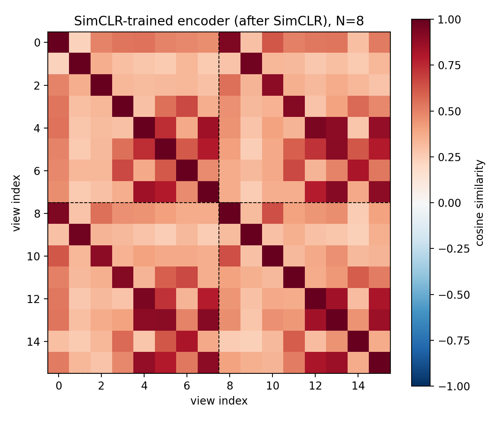
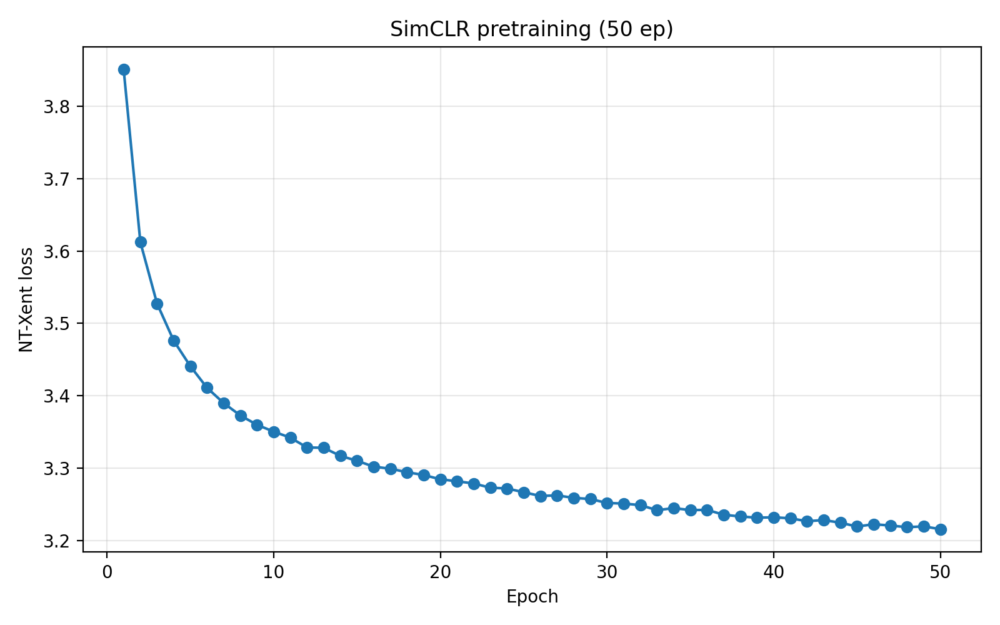
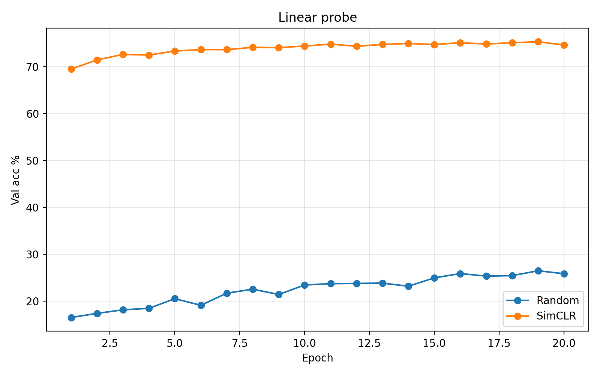
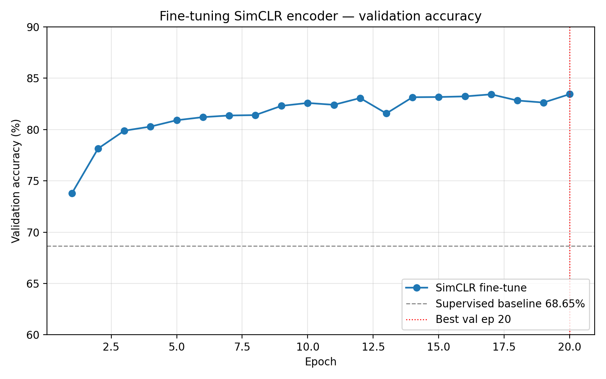
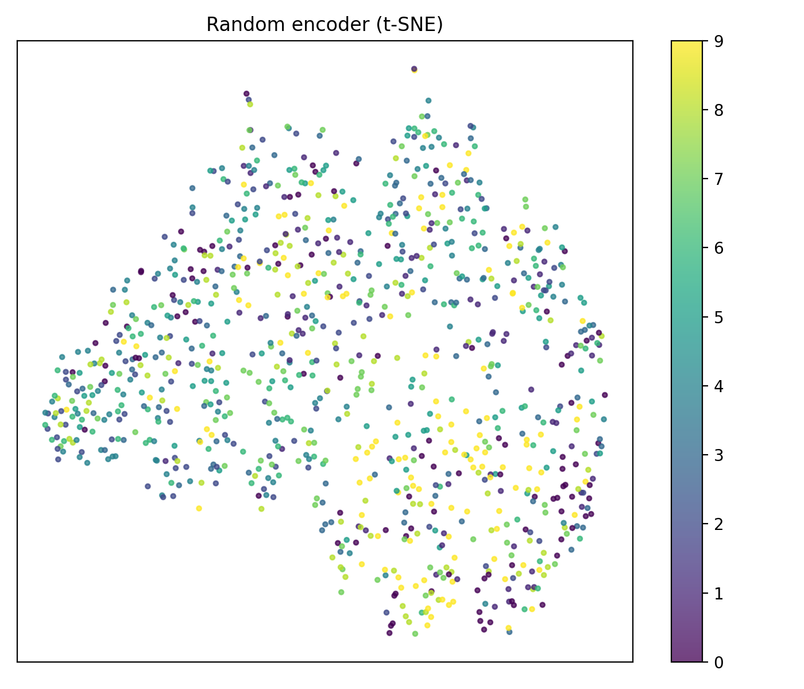
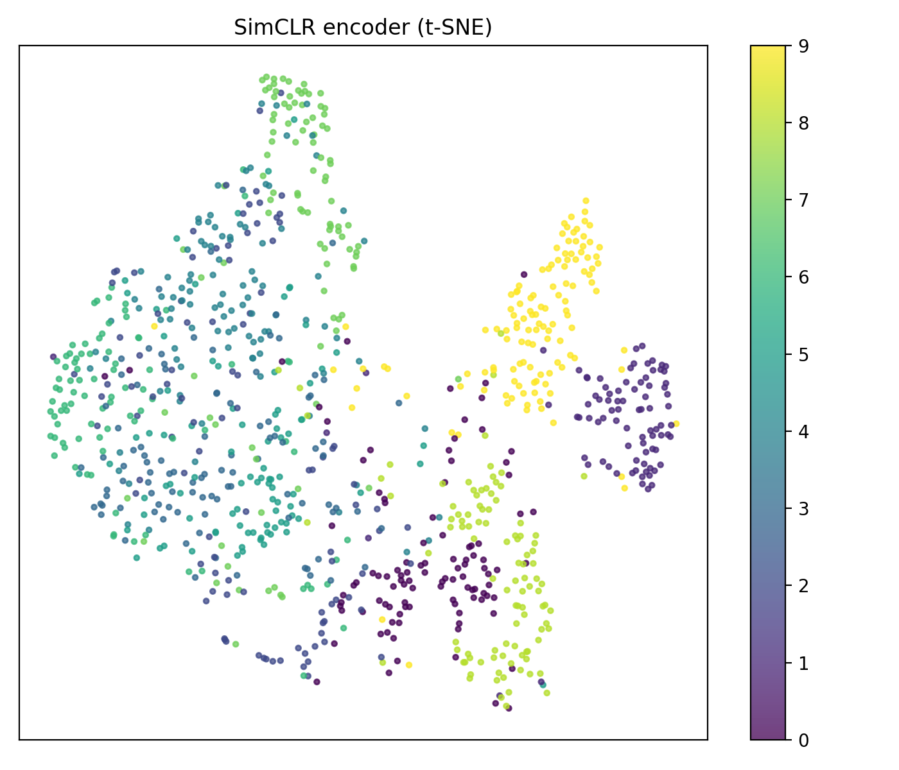
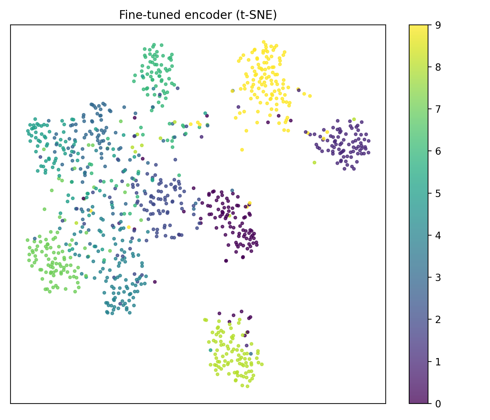

# SimCLR — Self-Supervised Representation Learning

Most supervised learning assumes you have a large labeled dataset. Self-supervised learning asks: can we learn useful visual representations using only the images themselves, with no labels at all?

SimCLR answers yes. The idea: take one image, create two differently-augmented views, and train a network to agree those two views are "the same image" while disagreeing on views from different images. With enough augmentation variety, the model must learn meaningful visual structure to solve this.

This project implements the full SimCLR pipeline on CIFAR-10 and measures how much the self-supervised representations help when only 10% of labels are available.

## The Problem

45,000 unlabeled CIFAR-10 images, only 10% of labels (~4,500 labeled examples). Can contrastive pretraining on the unlabeled data produce better representations than random initialization? How does label-efficient transfer compare to full fine-tuning?

## What I Built

### Encoder — Modified ResNet18

Standard ResNet18 is designed for 224×224 inputs. For CIFAR-10 (32×32), two changes were made:
- `conv1`: kernel size 7→3, stride 2→1
- `maxpool`: replaced with `nn.Identity()` to avoid spatial collapse on small inputs

### Projection Head

A 2-layer MLP used only during pretraining: `Linear(512→256) → ReLU → Linear(256→128)`. The projection head is discarded after pretraining — the 512-d encoder output is what gets transferred downstream.

### NT-Xent Loss

For a batch of N images, two augmented views give 2N total samples. The loss treats the two views of the same image as a positive pair and all other 2(N-1) views as negatives:

```
L = -log[ exp(sim(zᵢ, zⱼ) / τ) / Σₖ exp(sim(zᵢ, zₖ) / τ) ]
```

Temperature τ = 0.5. Cosine similarity throughout.

## Results

### Augmentation Views



### Similarity Matrix — Before vs After Training

Before pretraining, a random encoder assigns nearly identical similarity to same-image and different-image pairs (~0.98 vs ~0.98). After SimCLR, same-image pairs score ~0.91 and cross-image pairs drop to ~0.43.




### Pretraining Loss



### Linear Probe and Fine-tuning




### t-SNE Embeddings

| Random | SimCLR Pretrained | Fine-tuned |
|---|---|---|
|  |  |  |

### Final Numbers

| Method | Test Accuracy |
|---|---|
| Supervised baseline (10% labels) | 68.65% |
| Random encoder — linear probe | 26.70% |
| **SimCLR encoder — linear probe** | **74.68%** |
| **SimCLR encoder — fine-tuned** | **82.81%** |

The SimCLR linear probe (74.68%) beats the supervised baseline (68.65%) using only unlabeled data for pretraining.

## How to Run

```bash
pip install -r requirements.txt
```

Place the split files in `splits/`:
```
splits/train_ssl_unlabeled.txt
splits/train_labeled_10percent.txt
splits/val.txt
splits/test.txt
```

**Full pipeline:**
```bash
python BSCS22008_05_allCode.py
```

**Individual tasks:**
```bash
python BSCS22008_05_task1_supervised.py    # Supervised baseline
python BSCS22008_05_task2_augmentations.py # Augmentation visualization
python BSCS22008_05_task3_similarity.py    # Similarity matrix (pre-training)
python BSCS22008_05_task4_simclr.py        # SimCLR pretraining
python BSCS22008_05_task5_linear_probe.py  # Linear probe
python BSCS22008_05_task6_finetune.py      # Fine-tuning
```
